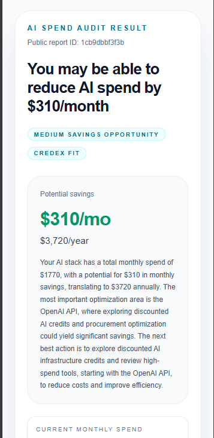

# AI Spend Auditor

AI Spend Auditor is a full-stack Next.js application for startup founders, CTOs, engineering managers, and small teams that want a faster way to review recurring AI software and API spend. Users enter their team context and current AI stack, and the app returns a deterministic savings audit with actionable recommendations, a shareable public report URL, and an optional follow-up flow after value has already been delivered.

The project focuses on a practical product constraint: AI is used only to explain the audit result, never to calculate it. Savings logic stays rule-based, testable, and explainable, while the surrounding experience handles persistence, public reports, lead capture, and transactional email.

## Live Demo

- Deployed app: [Live demo: https://audit.danishdev.me](https://audit.danishdev.me)

## Screenshots / Demo

Demo video:

- [`https://jumpshare.com/share/xM3SVsQjrEVTcPWHgrHf`](https://jumpshare.com/share/xM3SVsQjrEVTcPWHgrHf)

Screenshots:

- Home page


- Public audit result page



## Features

1. Clean landing page
2. Multi-step AI spend input form
3. Form persistence with `localStorage`
4. Rule-based audit engine
5. Public shareable audit report URL
6. AI-generated personalized summary using Groq
7. Fallback summary when LLM fails
8. Lead capture after audit value is shown
9. Lead storage in Neon Postgres
10. Confirmation email using Resend
11. Honeypot spam protection
12. Audit engine tests
13. GitHub Actions CI

## Product Principles

- No login required
- Email is captured only after the user sees the audit result
- AI is not used for savings calculation
- Audit math is deterministic and explainable
- Public audit pages do not expose email, company name, or role
- If the AI summary fails, the app still works with a fallback summary
- Savings are estimates, not guarantees

## Routes

- `/` - landing page
- `/audit/new` - spend input form
- `/audit/[publicId]` - public audit report

## Tech Stack

- Next.js App Router
- TypeScript
- Tailwind CSS
- Neon Postgres
- Drizzle ORM
- Groq SDK for AI summary generation
- Resend for transactional email
- GitHub Actions CI
- Node test runner with `tsx`
- Vercel deployment

## Quick Start

### 1. Install dependencies

```bash
npm install
```

### 2. Create environment variables

Create a `.env.local` file in the project root:

```env
DATABASE_URL=
GROQ_API_KEY=
LLM_MODEL=llama-3.3-70b-versatile
RESEND_API_KEY=
EMAIL_FROM=AI Spend Auditor <audit@reports.danishdev.me>
NEXT_PUBLIC_APP_URL=http://localhost:3000
```

### 3. Set up the database

Generate and apply the schema with Drizzle:

```bash
npm run db:generate
npm run db:push
```

If you want to inspect the database locally:

```bash
npm run db:studio
```

### 4. Run the app locally

```bash
npm run dev
```

Open `http://localhost:3000`.

### 5. Run lint and tests

```bash
npm run lint
npm test
```

### 6. Run a production build

```bash
npm run build
```

## How It Works

1. A user enters team size, primary use case, subscriptions, API tools, seats, plans, and monthly spend.
2. The backend runs a deterministic audit engine to estimate savings and rank recommendations.
3. The result is stored in Postgres and assigned a public shareable ID.
4. A public audit page renders the saved result from the database.
5. An AI-generated summary is layered on top of the deterministic result for readability only.
6. After the user sees the report, they can optionally save it by submitting their email and receive a confirmation email.

## Decisions

### 1. Rule-based savings engine instead of AI-generated recommendations

The core audit logic is deterministic because pricing, seat review, overlap detection, and savings estimates need to be explainable and testable. AI is used only to summarize the result in natural language, never to calculate the result itself.

### 2. Lead capture after value, not before

The app shows the full audit before asking for contact details. This reduces friction, makes the product feel more trustworthy, and keeps the lead form tied to a real value exchange instead of gating access.

### 3. Public report URLs backed by the database instead of client-only storage

Early localStorage-based result pages were useful for prototyping, but they could not support refreshes, sharing, or cross-device access. Persisting audits in Neon Postgres makes the report durable and shareable while keeping the public payload limited to audit data only.

### 4. AI summary with fallback summary instead of hard dependency on an LLM

The summary layer improves readability, but the application should not fail if the LLM or API key is unavailable. The system stores a deterministic fallback summary whenever AI generation fails, so audit creation and report rendering stay reliable.

### 5. Minimal anti-spam protection before adding heavier auth or abuse controls

Lead capture currently uses a honeypot field and server-side validation instead of a heavier CAPTCHA or account wall. This keeps the form lightweight for legitimate users while still reducing basic bot submissions during the current stage of the project.

## Testing

The project includes automated tests for the audit engine using the Node test runner and `tsx`.

Run the test suite with:

```bash
npm test
```

## CI

GitHub Actions runs the following checks on pushes and pull requests to `master`:

- dependency installation with `npm ci`
- linting with `npm run lint`
- automated tests with `npm test`
- production build with `npm run build`

## Notes

- Savings are estimates based on public pricing and user-provided inputs.
- Public reports are designed to avoid exposing email, company name, or role.
- Transactional email is handled server-side only.

## License

This project is for portfolio and demonstration purposes unless a separate license is added.
